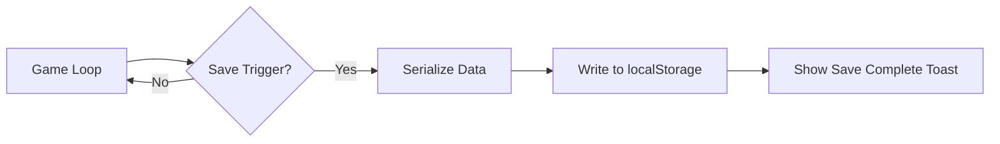

HOW SAVE GAME WORKS IN BARON'S BUDGETS

PLANNING file explains the save/load system architecture. The system preserves all persistent game state data using JSON serialization.

1. **Core Data Structure**
```json
{
  "map": {
    "terrainGrid": [],
    "terrainMap": [],
    "groundCells": [{"x": 10, "y": 20, "color": "#9ac558", "noise": "0.12345"}],
    "waterCells": [{"x": 5, "y": 15, "color": "#7cb9ec"}],
    "sandCells": [{"x": 8, "y": 12, "color": "#dbd997", "noise": "0.04321"}],
    "flatLandCells": [],
    "pathCells": [],
    "availableHouseCells": []
  },
  "resources": {
    "trees": [],
    "treePositions": [{"x": 120, "y": 345, "emoji": "🌲", "scale": 1, "opacity": 1, "rotation": 0}],
    "oreDeposits": [{"x": 50, "y": 60}]
  },
  "npcs": [
    {
      "myNumber": 1,
      "x": 456,
      "y": 789,
      "race": "Elf",
      "profession": "woodcutter",
      "inventory": {"wood": 5, "food": 12},
      "age": 25,
      "parentIds": [5, 8],
      "childrenIds": [12, 15],
      "spouseId": 3
    }
  ],
  "animals": [
    {
      "x": 200,
      "y": 300,
      "type": "creaturesCardSheep",
      "emoji": "🐑",
      "state": "idle",
      "isAlive": true,
      "age": 5000
    }
  ],
  "buildings": [
    {
      "type": "Farm",
      "x": 100,
      "y": 200,
      "owner": 10,
      "resources": "Infinity"
    },
    {
      "type": "Harbor",
      "x": 300,
      "y": 400,
      "owner": 15,
      "id": "harbor_1234567890_123"
    }
  ],
  "houses": [
    {
      "x": 150,
      "y": 250,
      "inhabitants": [7, 8]
    }
  ],
  "gameState": {
    "year": 2700,
    "isPaused": false,
    "gameLoopSpeed": 1000,
    "startingPopulation": 25,
    "populationIncreaseSpeed": 0.15,
    "resources": {
      "elfWoodCount": 800,
      "elfFoodCount": 1500,
      "elfCrystalliteCount": 200,
      "purriesWoodCount": 600,
      "purriesFoodCount": 1200,
      "purriesCrystalliteCount": 150,
      "kurohiWoodCount": 700,
      "kurohiFoodCount": 1300,
      "kurohiCrystalliteCount": 180
    },
    "playerRace": "Elf"
  }
}
```

2. **Save Process Flow**


3. **Load Functions Implementation**
```javascript
// game.js
function loadGame() {
  // Load game state variables
  year = savedGameState.year;
  isPaused = savedGameState.isPaused;
  gameLoopSpeed = savedGameState.gameLoopSpeed;
  startingPopulation = savedGameState.startingPopulation;
  populationIncreaseSpeed = savedGameState.populationIncreaseSpeed;
  
  // Load NPCs with proper prototype methods
  npcs = savedGameState.npcs.map(npcData => {
    const npc = new NPC(
      Math.floor(npcData.x / cellSize), 
      Math.floor(npcData.y / cellSize), 
      npcData.myNumber, 
      null, // Set parents later to avoid circular reference
      npcData.age
    );
    Object.assign(npc, npcData);
    return npc;
  });
  
  // Restore NPC relationships
  restoreNPCRelationships(npcs, savedGameState.npcs);
  
  // Load map data
  terrainMap = savedGameState.terrainMap;
  groundCells = savedGameState.groundCells;
  waterCells = savedGameState.waterCells;
  flatLandCells = savedGameState.flatLandCells;
  sandCells = savedGameState.sandCells;
  pathCells = savedGameState.pathCells;
  
  // Load resources
  trees = savedGameState.trees;
  treePositions = savedGameState.treePositions;
  oreDeposits = savedGameState.oreDeposits;
  
  // Load buildings
  houses = savedGameState.houses;
  buildings = savedGameState.buildings;
  
  // Redraw everything
  redrawWorld();
}

// Restore NPC relationships function
function restoreNPCRelationships(npcs, npcDataArray) {
  npcDataArray.forEach((npcData, index) => {
    const npc = npcs[index];
    
    // Restore parents
    if (npcData.parentIds && Array.isArray(npcData.parentIds)) {
      npc.parents = npcData.parentIds.map(id => 
        npcs.find(n => n.myNumber === id) || id
      ).filter(parent => parent !== undefined);
    }
    
    // Restore children
    if (npcData.childrenIds && Array.isArray(npcData.childrenIds)) {
      npc.children = npcData.childrenIds.map(id => 
        npcs.find(n => n.myNumber === id) || id
      ).filter(child => child !== undefined);
    }
    
    // Restore spouse
    if (npcData.spouseId !== undefined) {
      npc.spouse = npcs.find(n => n.myNumber === npcData.spouseId);
    }
  });
}

// Redraw world function
function redrawWorld() {
  // Clear canvases
  clearCanvas(groundCtx);
  clearCanvas(waterCtx);
  
  // Redraw terrain
  drawTerrainLayer(groundCtx, groundCells, cellSize);
  drawTerrainLayer(waterCtx, waterCells, cellSize);
  
  // Redraw sand and mountain textures
  drawSandTexture(groundCtx);
  drawMountainTexture(groundCtx);
  
  // Redraw trees
  clearCanvas(treeCtx);
  drawTrees(treeCtx, treePositions);
  
  // Redraw buildings
  buildings.forEach(building => {
    if (typeof building.draw === 'function') {
      building.draw(npcCtx);
    }
  });
}
```

4. **Variables to Store**

| Category | Variables | Description |
|----------|-----------|-------------|
| **Map** | terrainMap | 2D array of terrain colors |
| | groundCells | Array of land cell objects with x, y, color, noise |
| | waterCells | Array of water cell objects with x, y, color |
| | sandCells | Array of sand cell objects with x, y, color, noise |
| | flatLandCells | Array of flat land cells for building placement |
| | pathCells | Array of path cells between buildings |
| | availableHouseCells | Array of cells available for house placement |
| **Resources** | trees | Array of tree objects |
| | treePositions | Array of tree positions with x, y, emoji, scale, opacity, rotation |
| | oreDeposits | Array of ore deposit positions |
| **NPCs** | npcs | Array of NPC objects with position, race, profession, etc. |
| | parentIds | Array of parent NPC IDs (to avoid circular references) |
| | childrenIds | Array of child NPC IDs (to avoid circular references) |
| | spouseId | ID of spouse NPC (to avoid circular references) |
| **Animals** | animals | Array of animal objects with position, type, state, etc. |
| **Buildings** | buildings | Array of building objects (farms, harbors, etc.) |
| | houses | Array of house objects |
| **Game State** | year | Current game year |
| | isPaused | Whether the game is paused |
| | gameLoopSpeed | Speed of the game loop |
| | startingPopulation | Initial population size |
| | populationIncreaseSpeed | Rate of population growth |
| | elfWoodCount, elfFoodCount, elfCrystalliteCount | Elf resource counts |
| | purriesWoodCount, purriesFoodCount, purriesCrystalliteCount | Purries resource counts |
| | kurohiWoodCount, kurohiFoodCount, kurohiCrystalliteCount | Kurohi resource counts |
| | playerRace | Player's selected race |

5. **Functions to Run After Loading**

| Function | Purpose | Status |
|----------|---------|--------|
| `new NPC()` | Recreate NPC objects with proper prototypes | Exists |
| `restoreNPCRelationships()` | Restore parent/child/spouse relationships | [TODO] |
| `clearCanvas()` | Clear all canvases before redrawing | Exists |
| `drawTerrainLayer()` | Redraw terrain from saved cells | Exists |
| `drawSandTexture()` | Redraw sand texture | Exists |
| `drawMountainTexture()` | Redraw mountain texture | Exists |
| `drawTrees()` | Redraw trees from saved positions | Exists |
| `new Animal()` | Recreate animal objects with proper prototypes | [TODO] |
| `new Building()` | Recreate building objects with proper prototypes | [TODO] |
| `new Harbor()` | Recreate harbor objects with proper prototypes | [TODO] |
| `new Farm()` | Recreate farm objects with proper prototypes | [TODO] |
| `drawWaterTexture()` | Restart water animation | Exists |
| `initTreeLifecycle()` | Restart tree growth/death cycle | Exists |

6. **Critical Dependencies**
- Requires proper handling of circular references (parent/child/spouse relationships)
- Building system needs proper reconstruction of building objects with correct prototypes
- Animal system needs proper reconstruction of animal objects with correct behaviors

7. **TO-DO Items**
- [ ] Add fishing system data to save structure

8. **DONE**
- [x] DONE: Implement `restoreNPCRelationships()` function
- [ ] Add proper building reconstruction with correct prototypes
- [ ] Add proper animal reconstruction with correct prototypes


